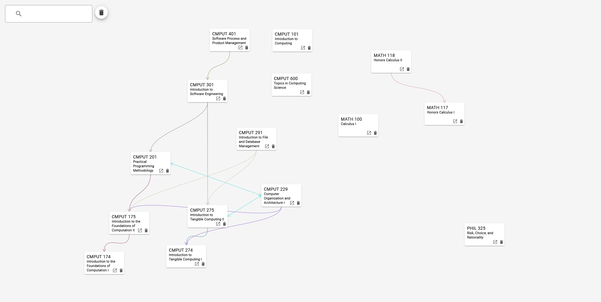

# Synapse
Synapse is a tool that generates interactive graphs of course prerequisites and corequisites using data extracted from the UAlberta course catalogue.

View it now on [steventango.github.io/synapse](https://steventango.github.io/synapse/)

## Build steps
1. `npm install`
2. `npm run build`

## Run

1. `npm install`
2. `npm start`

## Acknowledgements
* Bello, G. (2020, August). [How To Scrape a Website Using Node.js and Puppeteer](https://www.digitalocean.com/community/tutorials/how-to-scrape-a-website-using-node-js-and-puppeteer).
* Moreno, C. A. (2009, Fall). [Visualization of Course Requisites](https://era.library.ualberta.ca/items/8ad0cac6-0e95-4b71-980c-a65849a271f7/view/808ef335-add6-4d56-bd73-604e50c7f173/Arango_Moreno_Camilo_Fall_2009.pdf).